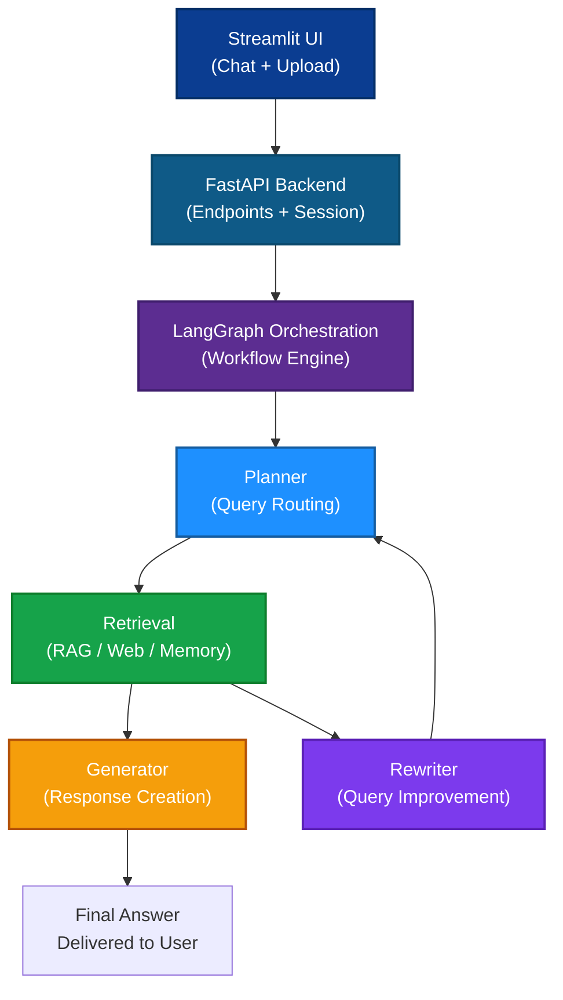
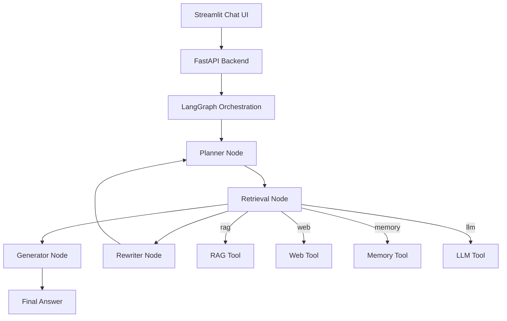

# Adaptive RAG - Agentic AI Chatbot


> Adaptive RAG is an intelligent, end-to-end Retrieval-Augmented Generation system with agentic AI routing, hybrid retrieval, and session-aware chat.

---

## � Adaptive RAG Flow



---

## �📋 Overview

Adaptive RAG is designed to adapt query handling dynamically across document retrieval, general knowledge, and real-time web search.

The application uses a modular LangGraph pipeline to:

- analyze the question,
- route it to the best toolchain,
- retrieve/document evidence,
- generate a response,
- and retry with query rewriting when needed.

This repository is built with FastAPI, Streamlit, Qdrant, LangGraph, OpenAI-compatible embeddings, and SQLite session storage.

---

## 🎯 Key Features

### 🧠 Intelligent Query Routing

Adaptive classification means the planner chooses the right answer path for each query.

- **Index**: Uses uploaded documents when the answer exists in the knowledge base.
- **General**: Uses LLM reasoning for general knowledge without retrieval.
- **Search**: Uses real-time web search for up-to-date or external information.

### 📚 Advanced RAG Pipeline

- **Document Processing**: Chunking and embedding for uploaded documents.
- **Vector Search**: Fast similarity retrieval via Qdrant.
- **BM25 Search**: Keyword-based retrieval for complementary coverage.
- **Relevance Grading**: Final results are reranked by a cross-encoder.
- **Query Rewriting**: Optimizes queries when retrieval fails or quality is low.

### 🤖 Agentic AI Architecture

- **Stateful LangGraph workflow** with planner, retrieval, generator, and rewriter nodes.
- **Tool orchestration** via `src/tools/registry.py`.
- **Multi-tool execution** for `rag`, `web`, `memory`, and `llm`.

### 💾 State Management

- **SQLite backend** for session and conversation persistence.
- **Session tracking** with individual conversation context per user.
- **Memory tool** to preserve recent chat history and summaries.

### 🎨 User Interface

- **Streamlit web app** with live chat experience.
- **Document upload** support for `PDF` and `TXT` files.
- **Session menu** with chat history and deletion.

### ⚡ API-First Architecture

- **FastAPI backend** with REST endpoints and Swagger docs.
- **Async operations** for non-blocking chat and session processing.
- **Streaming responses** available through SSE.

---

## 🏗️ Architecture



### System components

- `src/main.py` — FastAPI app entry point
- `src/api/chat.py` — chat and stream endpoints
- `src/api/routes.py` — document upload and session endpoints
- `src/agents/graph.py` — LangGraph pipeline definition
- `src/agents/planner.py` — tool selection and routing
- `src/agents/retrieval.py` — tool execution and aggregated retrieval
- `src/agents/generator.py` — answer generation
- `src/agents/rewriter.py` — query rewrite loop
- `src/rag/hybrid_search.py` — BM25 + Qdrant + reranking
- `src/tools/*` — tool wrappers for memory, RAG, web, and LLM

---

## 📊 Graph Nodes

- `planner` — classifies the query and selects tools
- `retrieval` — executes retrieval tools in parallel and merges results
- `generator` — produces the final text answer
- `rewriter` — rewrites queries when retrieval fails or the generator requests more context

---

## 📦 Project Structure

```
ragapp/
├── src/
│   ├── agents/
│   │   ├── agent.py
│   │   ├── graph.py
│   │   ├── planner.py
│   │   ├── retrieval.py
│   │   ├── generator.py
│   │   ├── generator_stream.py
│   │   ├── rewriter.py
│   │   ├── routing.py
│   │   └── prompts.py
│   ├── api/
│   │   ├── chat.py
│   │   └── routes.py
│   ├── ingestion/
│   │   └── document_ingestion.py
│   ├── llm/
│   │   └── llm_service.py
│   ├── models/
│   │   ├── chat_request.py
│   │   ├── chat_response.py
│   │   ├── chat_session.py
│   │   ├── chat_message.py
│   │   ├── document_schema.py
│   │   └── database.py
│   ├── rag/
│   │   └── hybrid_search.py
│   ├── services/
│   │   ├── document_service.py
│   │   ├── memory_service.py
│   │   └── summary_service.py
│   ├── tools/
│   │   ├── llm_tool.py
│   │   ├── memory_tool.py
│   │   ├── rag_tool.py
│   │   ├── registry.py
│   │   └── web_tool.py
│   ├── utils/
│   │   └── logger.py
│   └── vectorstore/
│       ├── bm25_store.py
│       ├── qdrant_connection.py
│       └── vector_store.py
├── streamlit_app/
│   ├── app.py
│   └── pages/1_Upload.py
├── requirements.txt
└── README.md
```

---

## 🔌 API Endpoints

Base URL: `http://localhost:8000`

1. **Chat**

- `POST /chat`
- Returns a normal chat response.

Example request:

```json
{
  "question": "What is the leave policy?",
  "session_id": "optional-existing-session-id"
}
```

Example response:

```json
{
  "session_id": "7ff928b8-9403-431f-a383-01f956e786bd",
  "answer": "The leave policy includes..."
}
```

2. **Streaming Chat**

- `POST /chat/stream`
- Streams answer tokens via Server-Sent Events.

3. **Chat History**

- `GET /chat/history/{session_id}`
- `DELETE /chat/history/{session_id}`

4. **Document Upload**

- `POST /documents/upload`
- Uploads and indexes `PDF`, `TXT`, or `DOCX` files.

5. **Session Creation**

- `POST /sessions`
- Creates a new conversation session.

---

## 📖 Usage Guide

### 1. Prerequisites

- Python 3.10+
- Qdrant running locally or remotely
- OpenAI API key
- Optional Tavily API key for web search

### 2. Install

```bash
cd ragapp
pip install -r requirements.txt
```

### 3. Environment Configuration

Create a `.env` file in the project root:

```env
OPENAI_API_KEY=your_openai_api_key
QDRANT_URL=http://localhost:6333
QDRANT_API_KEY=your_qdrant_api_key
QDRANT_COLLECTION=documents
TAVILY_API_KEY=your_tavily_api_key
DATABASE_URL=sqlite:///./ragapp.db
```

### 4. Run the Application

```bash
uvicorn src.main:app --reload
```

In another terminal:

```bash
streamlit run streamlit_app/app.py
```

Access:

- Streamlit UI: `http://localhost:8501`
- API docs: `http://localhost:8000/docs`

### 5. Example cURL

Upload a document:

```bash
curl -X POST http://localhost:8000/documents/upload \
  -F "source=policy" \
  -F "file=@your-document.pdf"
```

Query the bot:

```bash
curl -X POST http://localhost:8000/chat \
  -H "Content-Type: application/json" \
  -d '{"question": "What is the leave policy?", "session_id": "user_123"}'
```

---

## 🔧 Configuration

Key settings are loaded from environment variables in `src/ingestion/document_ingestion.py` and the service layer:

- `OPENAI_API_KEY`
- `QDRANT_URL`
- `QDRANT_API_KEY`
- `QDRANT_COLLECTION`
- `TAVILY_API_KEY`
- `DATABASE_URL`

---

## 💡 Notes

- `src/main.py` rebuilds the BM25 index on startup.
- Document uploads support PDF, TXT, and DOCX formats.
- The web UI provides session management and chat deletion.
- Query rewriting is used to recover from failed retrievals and improve answer quality.
